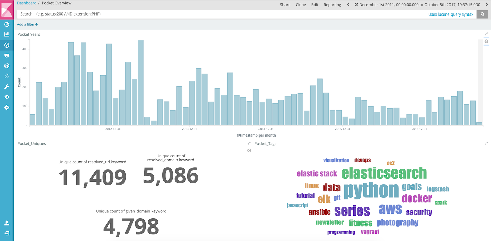

# Pocket Data with Elastic Stack & Docker

This repository will retrieve data from Pocket API, prep data for ingest into the Elastic Stack (Elasticsearch, Logstash, Kibana) using Elastic's official docker images and default ports. 
Tested with the latest version of the Docker daemon.

## Get the most our your Pocket Data!!
- Date Added
- Unique URLs
- Unique Given Domain
- Unique Resolved Domain
- Tag Cloud



As you can see, I've been a long time user of Pocket even before it was rebranded from Read It Later.

## Getting Started
Assumption is that you already have created a Pocket App and have Authenticated. 

If not, following instructions:

[Pocket Developer Site](https://getpocket.com/developer/)

[Create New App](https://getpocket.com/developer/apps/new)

[Authenticate](https://getpocket.com/developer/docs/authentication)

If you do not have an Pocket Account you can follow the Sample Data Example.

1. Retrieving Pocket API Data

**Best Practices** 

**Retrieving Full List:** Whenever possible, you should use the since parameter, or count and and offset parameters when retrieving a user's list. After retrieving the list, you should store the current time (which is provided along with the list response) and pass that in the next request for the list. This way the server only needs to return a small set (changes since that time) instead of the user's entire list every time.

`get-pocket-curl.sh` script perform a "complete" pull data which returns all data about each item, including tags, images, authors, videos, and more. JSON file is saved to `./data/raw` folder

``` 
sh ./files/get-pocket-curl.sh [since]

```

2. Prep Pocket Data 

``` 
sh ./files/get-pocket-curl.sh [since]

```

